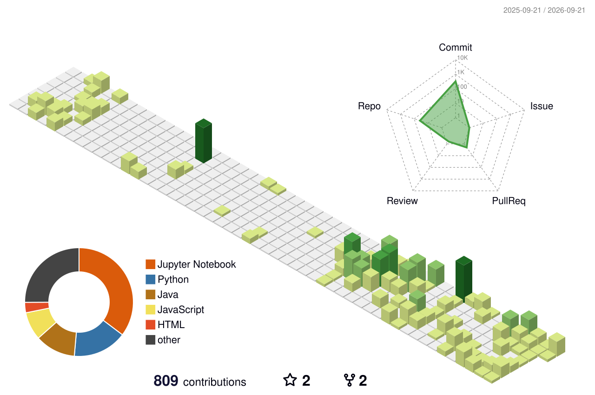

<h1 align="center">Hi 👋, I'm VENMUGIL RAJAN S</h1>

  

<h3 align="center">
  Computer Science and Engineering Student | Aspiring Software Developer
</h3>

  
  

  

## 👨‍💻 About Me

I'm a Computer Science and Engineering student from Erode, Tamil Nadu, who is genuinely curious about how great software gets built — from the underlying logic to the final pixel-perfect interface. My main goal is to grow into a strong **Software Developer**, and along the way I've been building full-stack and applied Machine Learning skills to back that up with real, hands-on experience.

* 🔭 Currently deepening my skills in **Software Development & Web Development** using React, Flutter, Next.js, Tailwind CSS, and PHP.
* 🎓 Pursuing my **B.E. in Computer Science and Engineering at Bannari Amman Institute of Technology** (2024 – 2028).
* 🌱 Actively exploring **UI/UX Design, Problem Solving, Data Structures & Algorithms, Machine Learning, and Deep Learning**.
* 💡 I genuinely enjoy **building full-stack web apps, deploying ML models, and creating interactive user experiences**.
* 🏆 Secured **2nd Place at the BIT Full Stack Hackathon**.
* 💻 Solved **100+ DSA problems on LeetCode**.
* 🤝 Always open to **collaborating on interesting projects, hackathons, and innovative ideas**.
* 📫 Feel free to reach out at **[venmugilrajans@gmail.com](mailto:venmugilrajans@gmail.com)**.
* ⚡ Fun fact: **Debugging is part of the daily routine — and honestly, half the fun of coding.**

  

## 💻 Technical Skills

### Languages

### Web Development

### Machine Learning / AI

### Databases & Tools

 

  
  
  
  
  
  
  
  
  

  
  
  
  

 

  

## 🚀 Featured Projects

### 🏆 Student Reward Management Platform

`React` `Flutter` `Tailwind CSS` `Firebase` `Firestore` `Python Cloud Functions`

* Built a full-stack reward platform with dynamic overall, department-wise, and year-wise leaderboard rankings for multi-role users.
* Developed responsive web and mobile applications using React and Flutter.
* Integrated real-time Firestore storage and Google Sheets synchronization.
* Implemented campus room mapping and reward computation.
* Deployed a scalable serverless backend using Python Cloud Functions for reward computation and push notifications.

### 📝 Online Leave Request Portal

`PHP` `MySQL` `JavaScript` `Google OAuth 2.0`

* Engineered a role-based leave management system with separate student and teacher portals.
* Implemented request, review, and approval workflows.
* Added Google OAuth 2.0 authentication.
* Implemented OTP-based password recovery.
* Used BCRYPT hashing and SQL-safe prepared statements.
* Added dynamic calendars and PDF report generation.

### 😊 Emotion Recognition System

`PyTorch` `OpenCV` `Gradio`

* Developed a CNN-based facial emotion recognition system classifying **7 emotion categories** in real time.
* Built a live webcam-enabled prediction interface using Gradio.
* Deployed the application on Hugging Face Spaces.

### 👁️ Diabetic Retinopathy Diagnostic System

`EfficientNet-B3` `PyTorch` `OpenCV` `Next.js` `Gradio`

* Engineered an end-to-end deep learning pipeline classifying Diabetic Retinopathy severity into **5 levels**.
* Fine-tuned a pre-trained **EfficientNet-B3** backbone.
* Achieved **72.54% validation accuracy**.
* Designed a preprocessing pipeline using Ben Graham's local contrast subtraction.
* Addressed class imbalance using **Focal Loss with Effective Class-Balanced Weights**.
* Worked with a dataset containing **3,600+ retinal fundus images**.
* Built a Gradio prototype backend and responsive Next.js dashboard.
* Deployed the frontend using Vercel.

---

## 📜 Certifications

* **Oracle Certified Professional: Java SE 17 Developer** — Oracle
* **Python for Data Science** — Cognitive Class (IBM)

---

# 📊 GitHub Statistics

  
  

  <i>📈 Statistics include the full commit history.</i>

---

# 🧊 3D Contribution Calendar

  

---

# 🐍 Contribution Snake

  <picture>
    <source
      media="(prefers-color-scheme: dark)"
      srcset="https://raw.githubusercontent.com/venmugilrajan/venmugilrajan/output/github-contribution-grid-snake-dark.svg"
    />
    <source
      media="(prefers-color-scheme: light)"
      srcset="https://raw.githubusercontent.com/venmugilrajan/venmugilrajan/output/github-contribution-grid-snake.svg"
    />
    
  </picture>

---

# 🗓️ Contribution Activity

  

---

## 🌐 Connect With Me

 

  <i>Thanks for stopping by — always excited to connect, collaborate, and build something great together! 🚀</i>

